## 服务订单系统 包含客户端 工程师端 后台管理
> 包括及时聊天 ,下单抢单, 完善中...

## demo 地址
http://o.08tj.com

## demo 部分截图

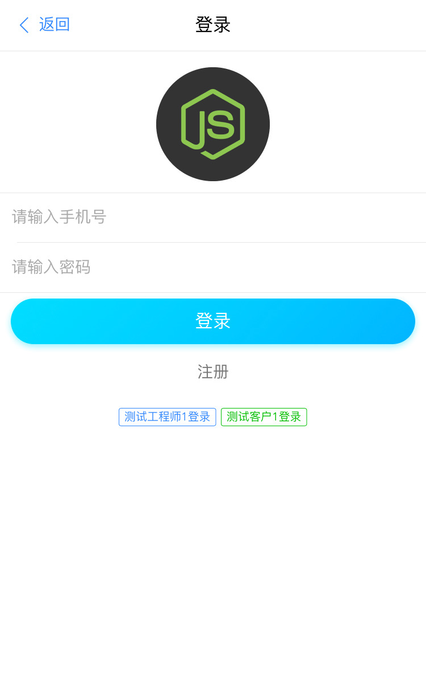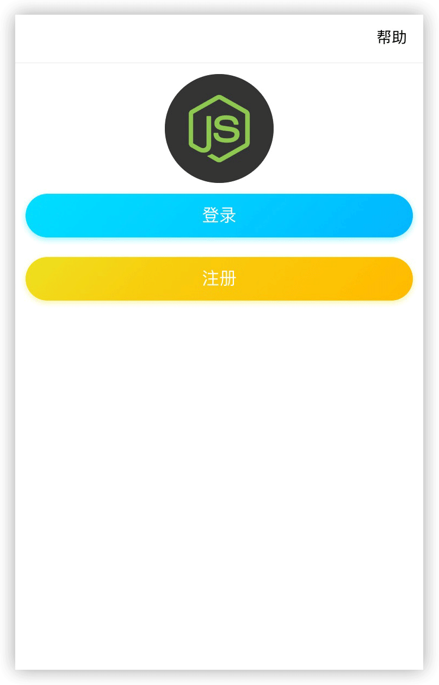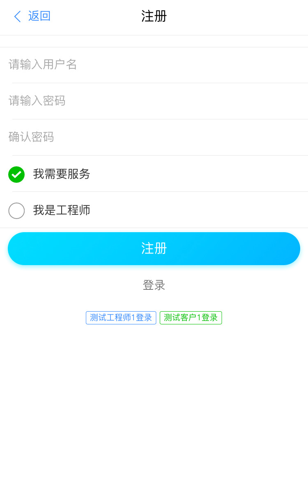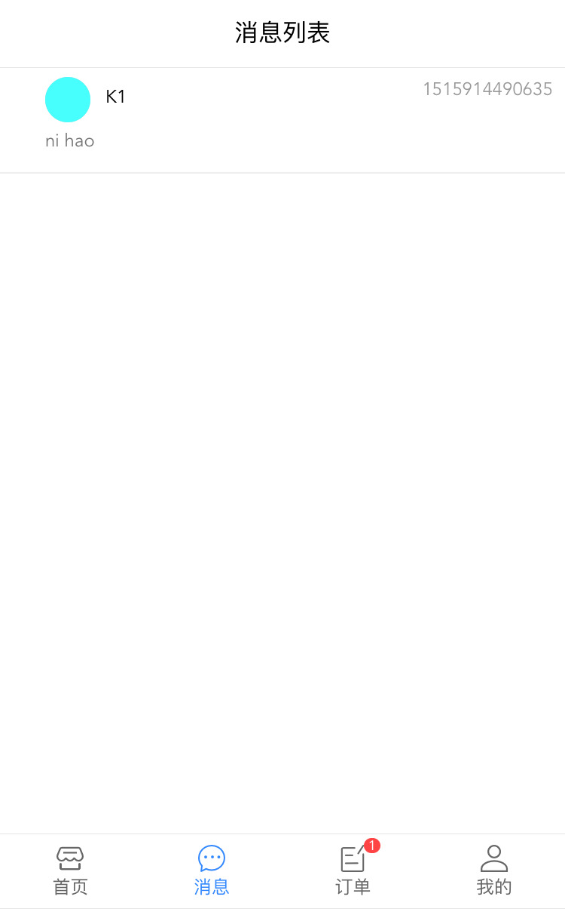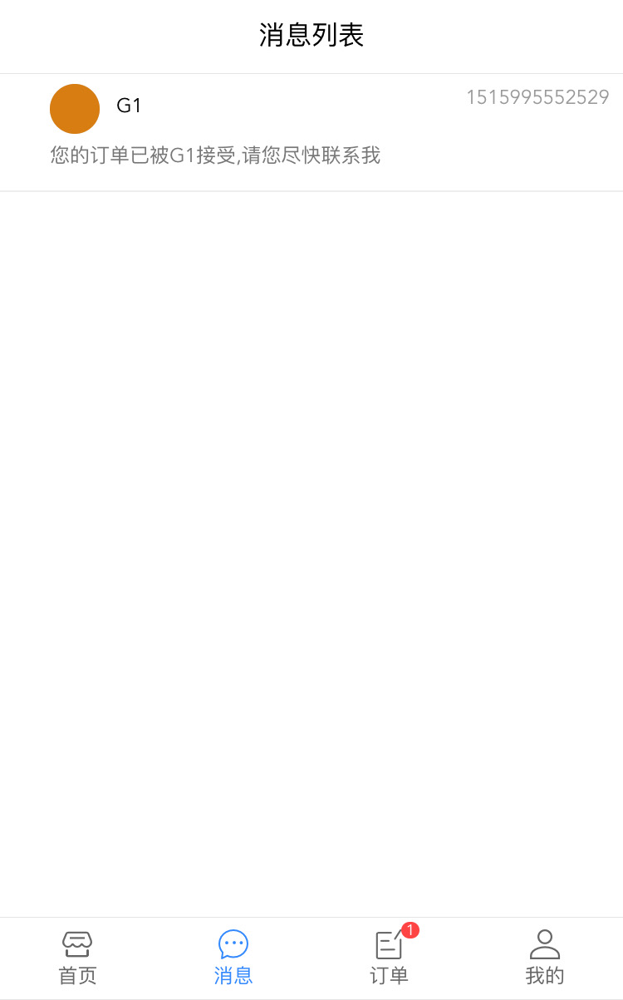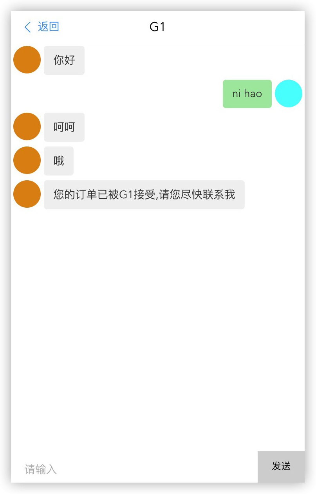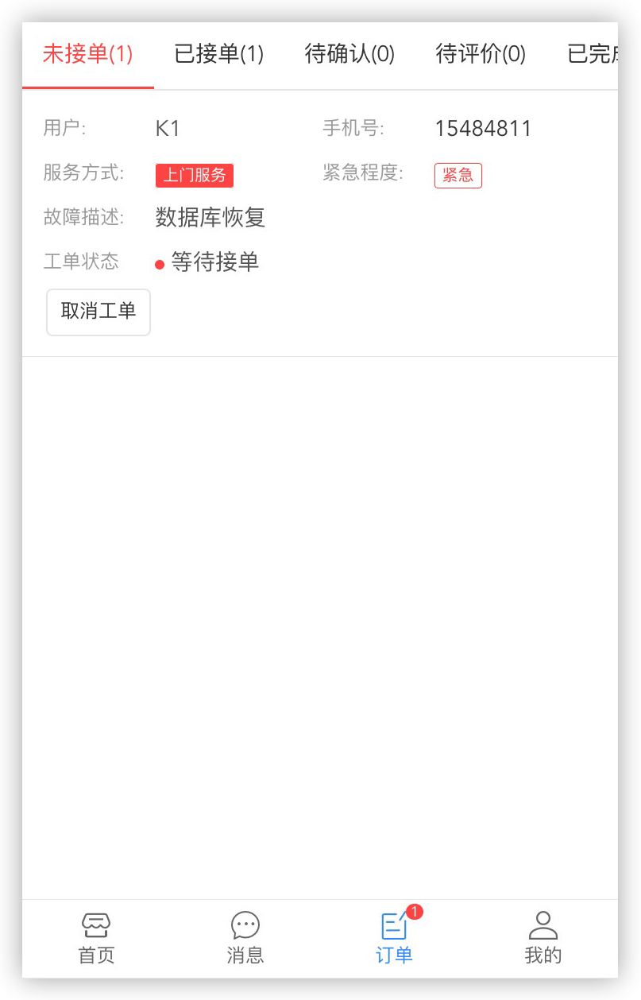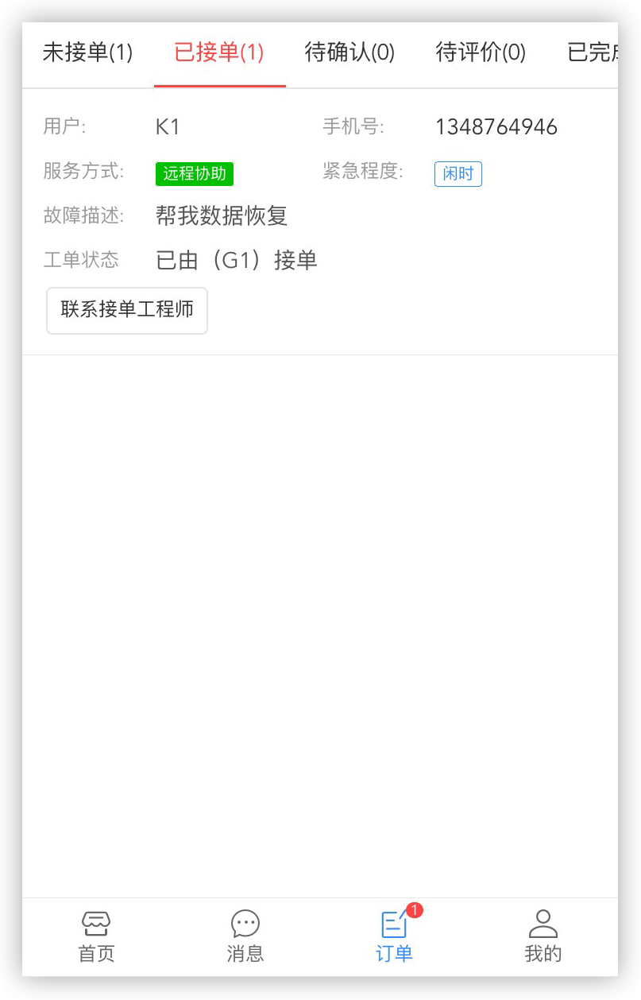

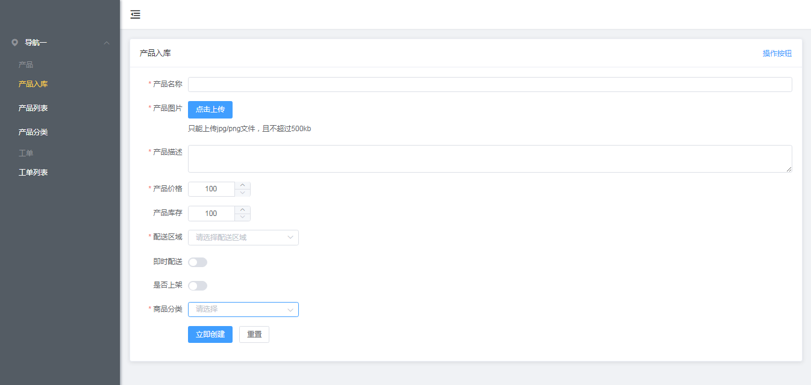
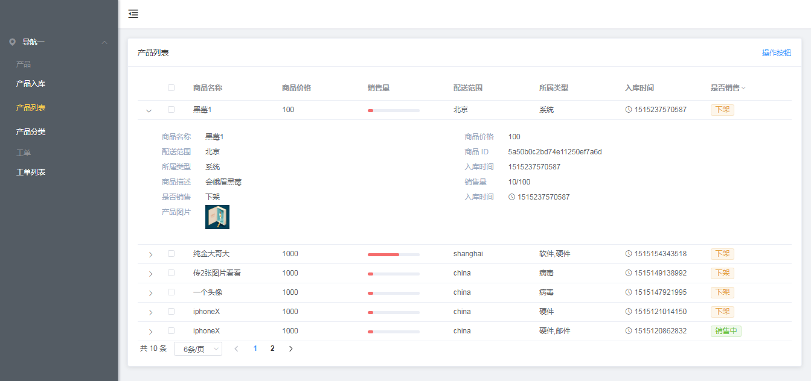
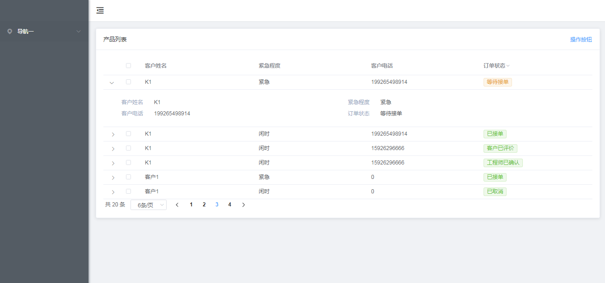

## 项目要求
1.nodejs 8.9.0+   
2.vuejs 2.5.0+    
3.webpack 3.0+    
4.mongodb 3.0+    
5.代码风格检查 standardjs   
6.react 16+      
7.react-router 4+


## 项目主要依赖
1.vue-router    
2.vuex      
3.elementui   
4.vantui    
5.socketio    
6.axios   
7.express   
8.mongoose  
9.react     
10.react-router-dom     
11.redux        
12.react-redux          

## 项目启动  
0.数据库启动   
```
mongod --dbpath d:/MongoDB/data
```
1.后端服务启动    
```
cd server
hotnode server.js
```
2.后端管理启动    
```
cd admin
npm run dev
```
3.客户端启动   
```
cd order
npm run dev
```
4.react客户端
```
cd react-order
npm start
```

## 基本功能
1.一个结合实际商业模式演变的一个mini订单服务业务系统（ps:仅供学习）   
2.用户场景包含`客户`和`工程师`    
3.客户有it服务需求如 `安装office` `装系统` `数据库维护` 就来客户端下单   
4.客户下单后所有的工程师都会收到下单消息提醒，工程师 `闲时` 就可以抢单    
5.工程师抢单后客户会收到工程师的接单信息     
6.客户与工程师发生服务关系（工程师接单）既可以彼此聊天    
7.订单状态流程 下单(未接单)-> 取消(未接单前可取消) -> 接单(彼此可实时聊天) -> 工程师完成订单 -> 客户确定完成(待评价) -> 评价(完成)   
8.订单提示 客户看自己被接单的信息    
9.订单提示 工程师看所有客户未接单信息  
10.后台可以添加商品可以查看订单


